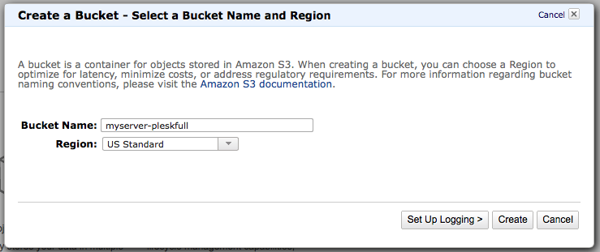
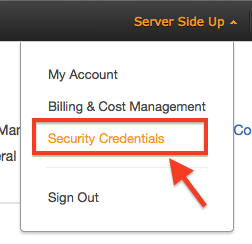
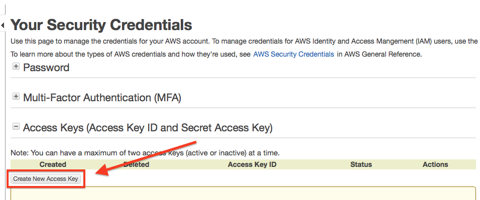
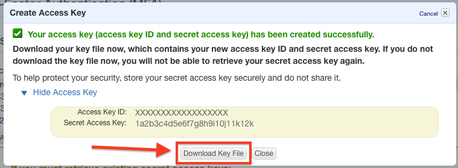
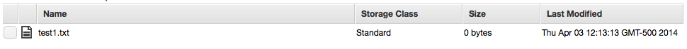

# Configure Amazon Access
Before we start hacking away to get this server connected, we need to make sure that we have [S3 buckets](http://docs.aws.amazon.com/AmazonS3/latest/dev/UsingBucket.html) created and the right credentials to run a backup. Log into [Amazon AWS](http://amazon.com/aws). Once you are logged in, then proceed to click on *S3* then you should be able create your Amazon S3 bucket using the on-screen prompts.

In this example, I will be using a bucket named ``myserver-pleskfull``, but your bucket name must be original and not conflict with any other bucket names on Amazon S3. Whatever you name this bucket, we will configure full server Plesk backups to go into this bucket. Make sure you change my code to whatever your bucket name is as you progress through the book.



```
***Best Practice Note***
If this Amazon account is only going to be accessed by one user, one server, only one user has root access to your server, and any Amazon buckets will be used only to store backups for this server… then you can proceed further down this post. If this is an existing account and you have multiple users, multiple servers, and/or you just want heightened security — then I would definitely configure policies and different security settings through Amazon IAM (Amazon Identity and Access Management). Configuring correct bucket access can help you prevent malicious users, software, etc. from gaining access to ALL of your buckets if you lock them down individually. Since I don’t want to go on a tangent talking about IAM, read that link for the AWS IAM Best Practices.
```

## Create Access Keys
When you are logged into the AWS Console, click on your name and then choose security credentials.



Then choose *Create New Access Key*:



When you create the keys, be sure to download them — because you will NEVER see them again otherwise!



Once you have that downloaded, run ``aws configure`` you will be prompted to enter your credential information. Here is the output of the ``aws configure`` command:

```
[root@myserver ~]# aws configure
AWS Access Key ID [None]: XXXXXXXXXXXXXXXXXXXX
AWS Secret Access Key [None]: 1a2b3c4d5e6f7g8h9i10j11k12k
Default region name [None]: us-east-1
Default output format [None]:<LEAVE BLANK -- JUST PRESS ENTER>
```
#### Important Note for Default Region
For the default region, I chose us-east-1, but you can choose whatever region you would like by seeing the list from Amazon [here](http://docs.aws.amazon.com/AWSEC2/latest/UserGuide/using-regions-availability-zones.html). For what we are doing in the scope of this article, the regions are irrelevant to Amazon S3 but if you do any management of other AWS regions — it may be very important to set this correctly. You can also see that I left *Default output format [None]:* blank. This will default to JSON. You can read more about your options [here](http://docs.aws.amazon.com/cli/latest/userguide/cli-chap-getting-started.html).

## Test Amazon Access
Now that we have our authentication configured, you should now be able to test it out. Create some test files in your home folder on the server you will be backing up:

```
[root@myserver ~]# mkdir -p test-parent-folder/
[root@myserver ~]# touch testfolder/test1.txt
```
If you run ``ll`` or ``ls -l`` you should see your folder there. Now lets run the command to move it up to our S3 Bucket. Remember the bucket name that we chose from above is ``myserver-pleskfull``. The syntax for the ``aws`` command is the following:

```sh
aws [options] <command> <subcommand> [parameters]
```
Using the syntax above (advanced syntax can be found [here](http://docs.aws.amazon.com/cli/latest/reference/)), we can now run our move command and watch its results:
```
[root@myserver ~]# aws s3 mv testfolder/ s3://myserver-pleskfull --recursive
move: testfolder/test1.txt to s3://myserver-pleskfull/test1.txt
```
Now when you check the bucket in the Amazon Console, you can see that it appears (notice how it copied just the file, not the folder):



You can also check via command line:
```
[root@myserver ~]# aws s3 ls s3://myserver-pleskfull-full --recursive
2014-04-03 12:13:13          0 test1.txt
```

