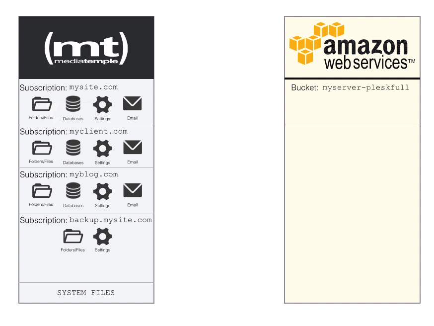
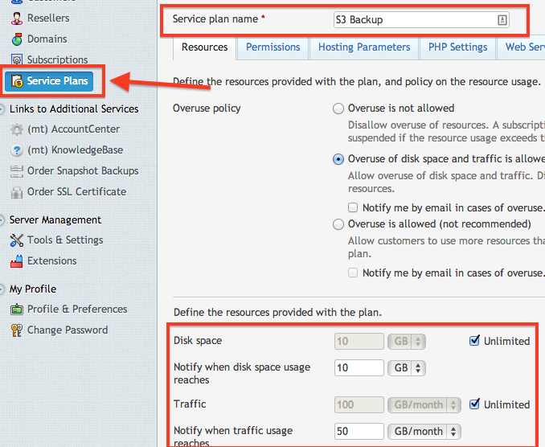
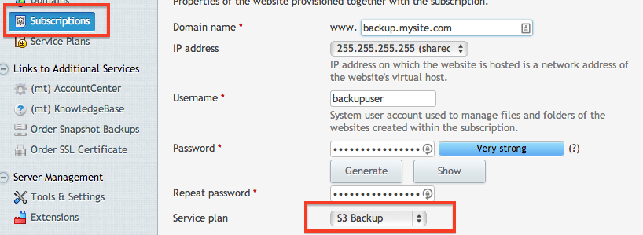
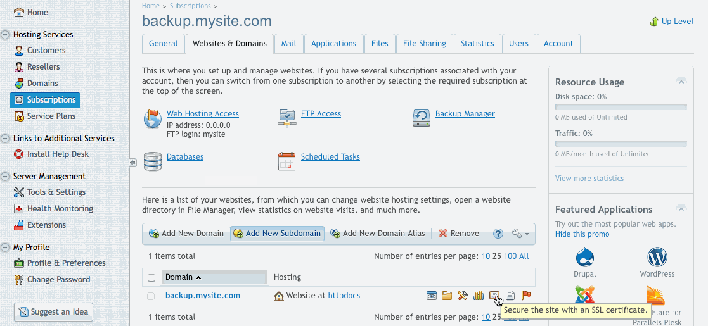
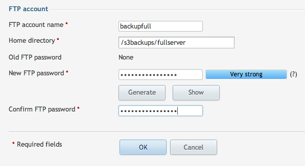
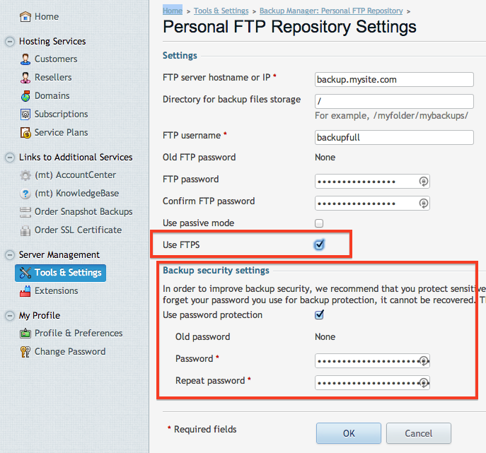
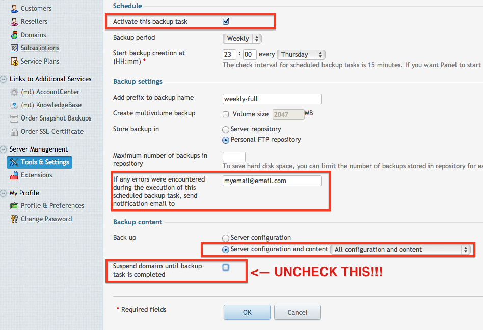
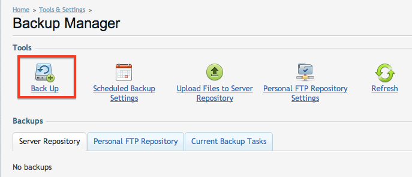
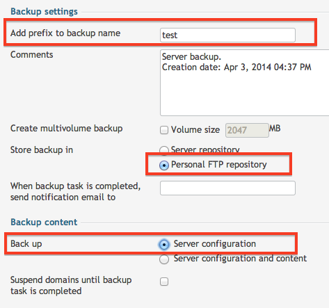
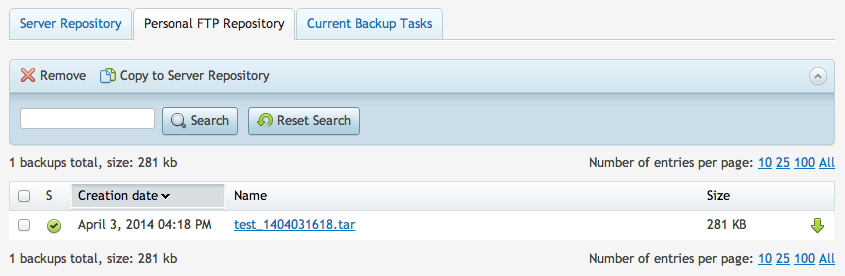

# Configure Plesk for Full Backup

So this is going to be interesting on how this works… We are going to use the native Plesk Backup Manager, but we are going to choose the FTP solution and the server will essentially FTP the backup file to itself. Sounds very strange, but there are a few reasons why I did it this way which we will discover as we go through the set up.

Here is an image that essentially demonstrates our full server backup:



Now since we have the logic down, we have to create a Subscription to store our backups. But before we do that, we need to make sure that we have a Plan that will allow us to do that. Plesk would get quite emotional if we tried to store our 5GB backup in a plan that only allowed 1GB. To do this, select *Service Plans*, choose *Add New Plan*. Set the name to *S3 Backup* and make sure that you allow Unlimited storage a subscription and Traffic (you can choose whatever subdomain that you want). It would also be a wise choice to set the notifications to make sure that your subscription does not get out of control. Set these values to whatever you think suits your server best. Since our backups will be *MOVED* (not copy) to Amazon S3, we don’t have to worry about the subscription keeping an archive of backups.



Once you have the Service Plan created, it’s now time to create the Subscription. You can use any domain that you would like, but it just has to **exist and have the DNS properly pointed to your server’s IP address**. Once you have your domain configured, create the Subscription and assign it to the new plan that we created.



Once the subscription is created, let’s lock down that subscription so we don’t have any data leaks. We won’t be needing any web hosting, only FTP:



Now that we have the web hosting disabled, we can create our directories for our backup (be sure to change the path to the domain name that you chose):

```
mkdir -p /var/www/vhosts/backup.mysite.com/s3backups/fullserver
```
Before we get too excited, we need to make sure that our ``backupuser`` has ownership of the ``s3backups`` folder.

```
chown -R backupuser:psacln /var/www/vhosts/backup.mysite.com/s3backups/
```
This directory that we just created is what we will be using to store our full server backups. We now need to create an FTP account that will have access only to this directory.



The user is now configured, but we need to tell our server where to run the backup. Go to *Tools & Settings* and then choose *Personal FTP Settings*. Here is where you can enter in the information that we just created. When you are filling this out, be sure to select **FTPS**. Even though we are sending it to ourselves, we want to make sure that we use **FTPS** to secure the transfer. Also, it is a wise idea to create an archive password. This is another step that will prevent unauthorized hands from getting on your data. **Be sure to save these passwords in a safe place!**:



With the FTP settings set, we can now schedule our backup to run. Choosing the frequency of the backup is all up to you. Yes, Amazon is only pennies per GB, but it can add up fast if you are running large backups frequently. Go back to the *Backup Manager* then choose *Scheduled Backup Settings*.


When you are configuring your settings, be sure that you click Activate at the top (many people forget to select that). Fill out the other fields anyway you want, but you can put in your email for notifications upon any errors (very good idea). Also, make sure that you select *All Configuration and Content* and make sure you uncheck the domain suspension. This will disable your sites while the backup runs. Only in special cases would you want that to happen.



## Testing The Backup

We’re almost there! Now we can test it by choosing *Backup* from the Backup Manager.



Here is where we can run our first test. Instead of backing up everything, lets just back up the server configuration. This will save A LOT of time in testing.



It will start to run a backup. This is your cue to go grab another coffee/beer while it finishes. Once it is complete, you will see it appear in the Personal FTP tab:



Since that backup is done, lets see where it is at. We can check by running the ``ll`` or ``ls`` command:
```
[root@myserver ~]# ll /var/www/vhosts/backup.mysite.com/s3backups/fullserver
total 284
-rw-r--r-- 1 backupuser psacln 287916 Apr  3 16:18 test_1404031618.tar
```
Now since the file is there, lets move it to Amazon S3. This is going to be the same command as our test from before, but we need to change the directory to the *fullserver* directory. You will see its output as it moves the file.

```
[root@myserver ~]# aws s3 mv /var/www/vhosts/backup.mysite.com/s3backups/fullserver/ s3://myserver-pleskfull --recursive

move: ../var/www/vhosts/backup.mysite.com/s3backups/fullserver/test_1404031618.tar to s3://myserver-pleskfull/test_1404031618.tar
```

We can now list out the directory on the Amazon S3 bucket to confirm our file made it safely. When I run the command, you can see it shows our test text file as well:

```
[root@myserver ~]# aws s3 ls s3://myserver-pleskfull --recursive
2014-04-03 12:13:13          0 test1.txt
2014-04-03 16:47:19     287916 test_1404031618.tar
```
