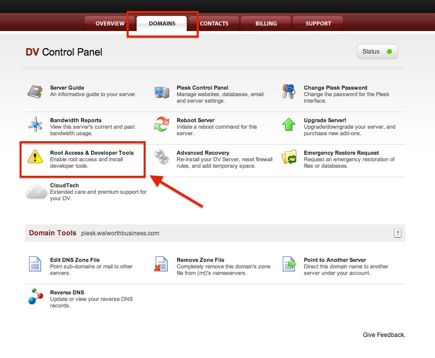
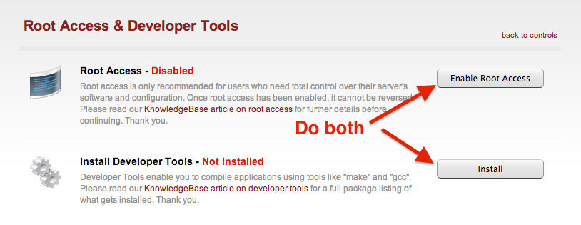

# Prepare The Server

## Enable Root Access

Now since I’ve got the legal mumbo-jumbo taken care of, lets put the rubber to the asphalt by making sure that you have root access. We will be making changes to the system that require higher permissions, so if you are not doing this with the root account — we won’t be getting too far. By default, new Dedicated Virtual servers are shipped with root access disabled. You can do this in the Account Center at Media Temple.

Now since I’ve got the legal mumbo-jumbo taken care of, lets put the rubber to the asphalt by making sure that you have root access. We will be making changes to the system that require higher permissions, so if you are not doing this with the root account — we won’t be getting too far. By default, new Dedicated Virtual servers are shipped with root access disabled. You can do this in the [Account Center](http://ac.mediatemple.net/) at Media Temple.



When you click on that, you will need to configure BOTH items. This means you will have to **enable root access** and install the **Developer Tools**.



This may take a minute or two for this to complete. That’s okay, it is a perfect amount of time to grab a coffee/beer and come back to a screen with green text saying “Enabled” and “Installed”.

## Download and Install Amazon AWS CLI Tools


Now that we have the correct access and libraries to do some compiling, we need to download [Amazon AWS CLI Tools](http://aws.amazon.com/cli/) (Amazon Command Line Interface Tools). These tools will allow us to connect to Amazon’s services without installing all of this weird poo poo to get connected (been there, done that). Servers generally do not like poo poo so it is important that these tools are officially supported by Amazon and they do not make Plesk crap itself.

Before we dive in and start running Amazon commands, to the date of this post these tools do require Python 2.6 or higher. To do that, simply run the ``python --version`` command to see what version you are running. It should echo out the version on the line below.

### Check Python Version (must be 2.6 or higher)
Below you can see the output of the ``python --version`` command:
```
[root@myserver ~]# python --version
Python 2.6.6
```
Sweet, it looks like I am good to go on this server. Now we have to download the tools… OH WAIT! *There’s more!* Remember my line above where I said we do not have to download a bunch of weird poo poo? We do have to download something called [pip](http://www.pip-installer.org/) (which is a package manager for Python), but trust me — this is very safe based off of the other methods that I have seen. Pip will simplify the installation process for us.

### Install pip (Python Package Manager)
The command below will download the latest version of ``pip`` and execute the installation:
```
wget --no-check-certificate https://raw.github.com/pypa/pip/master/contrib/get-pip.py; python get-pip.py
```
### Install Amazon AWS CLI
Sweet! We have ``pip`` installed on our server, so lets use ``pip`` to install Amazon’s CLI Tools:
```
pip install awscli
```
Well, that was quite simple… check for errors, but if everything looks good — we are now ready to prepare our connection to Amazon S3.
