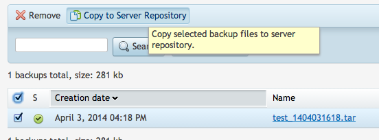
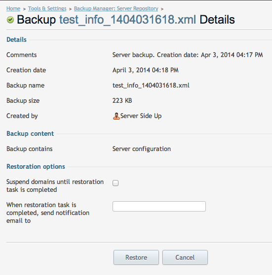

# Restoring From A Backup
The most important piece in a backup process is the restoration. For most people, it’s usually the least tested piece of the process. To get this to work, we are just going to copy the file that we want back into our FTP folder. Make sure you change ``backup-file.tar`` to your actual file name that you want.

```
aws s3 cp s3://myserver-pleskfull/test_1404031618.tar /var/www/vhosts/backup.mysite.com/s3backups/fullserver
```
We will get the results below:
```
[root@myserver ~]# aws s3 cp s3://myserver-pleskfull/test_1404031618.tar /var/www/vhosts/backup.mysite.com/s3backups/fullserver/

download: s3://myserver-pleskfull/test_1404031618.tar to ../var/www/vhosts/backup.mysite.com/s3backups/fullserver/test_1404031618.tar
```

Once you have it in the FTP folder, you should now be able to copy it to your server repository. (It will ask you for your restore password, so I hope you wrote that down!):



Then once it is in your server repo, you can click on that file to initiate the restore:



