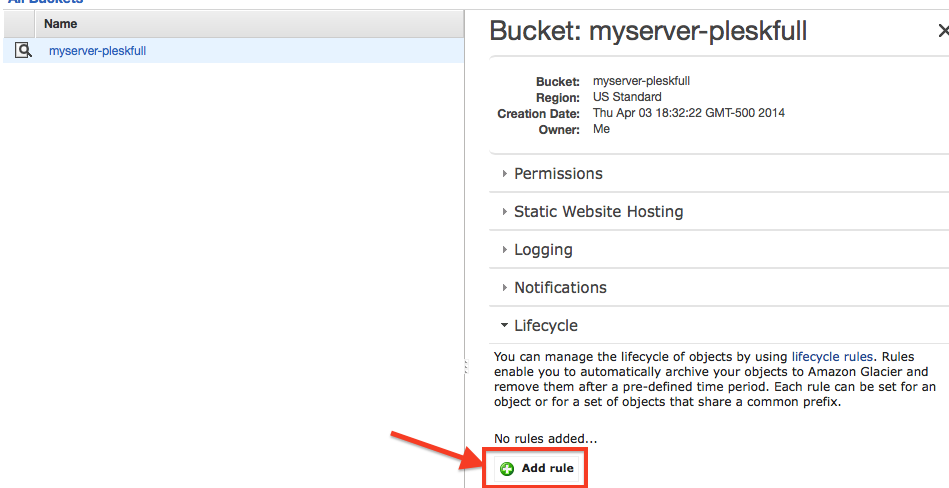
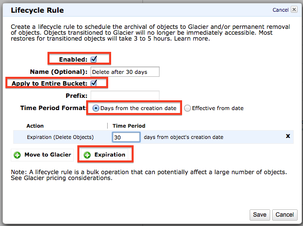

# Configure Retention Policies
To prevent from paying a butt-load in Amazon S3 charges, it is a wise idea to configure retention policy. You can automatically have Amazon S3 delete the file after X amount of days or you can archive it to [Amazon Glacier](http://aws.amazon.com/glacier/pricing/). The thing that you have to plan for on Amazon Glacier, is that when you want your file for restoration, it takes Glacier 4 hours to get your file ready before you can download it. That could be a disaster if that is a very important backup file that you need RIGHT AWAY.

Log into your Amazon AWS Console and then select the bucket. Under *Properties* you will find an accordion menu that says *Lifecycle*. Click on that then press *Add rule*:

.

Then you can configure the bucket to delete any objects X amount of days from its creation date.

