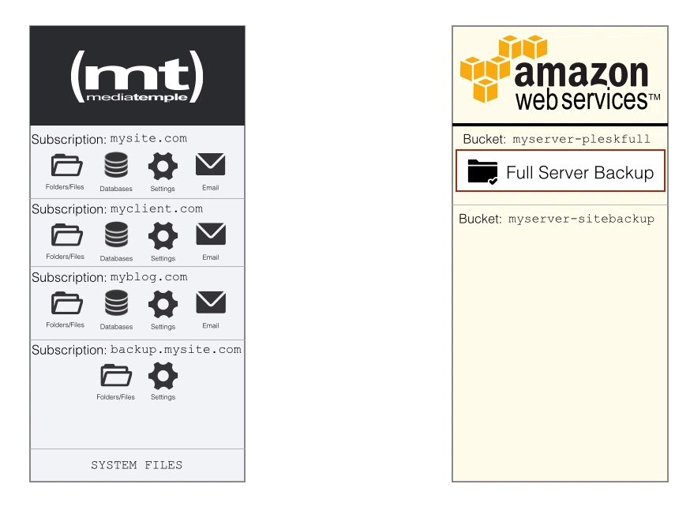

# Configure Subscription Specific (Vhost) Backups

You can also store single site backups in a separate bucket. Why would we want to do that? A separate bucket makes sense because we can run different backup frequencies and also apply different retention policies. Here is how it would work:



To configure the backups, we would have to create another folder for our site backups:

```
mkdir -p /var/www/vhosts/backup.mysite.com/s3backups/sites/
```

Be sure to set the right permissions after that:

```
chown -R backupuser:psacln /var/www/vhosts/backup.mysite.com/s3backups/sites/
```

Now you can go into the backup.mysite.com subscription and create specific FTP users for your sites. Once you have those users created, you can then go into the subscription that you want to backup and configure the Backup Manager (just like how we did it for our Full Server backup). We will also have to modify our script in the cron.hourly:

```
nano /etc/cron.hourly/aws-s3move
```
Then update the script to this. Be sure to configure the options at the top! ([Online Version available here](https://gist.github.com/jaydrogers/9957551#file-amazons3move-sitesandfull-sh))

```
#! /bin/bash
# Author: Jay Rogers - jay@521dimensions.com

#IMPORTANT -- CONFIGURATION VARIABLES
BACKUPDOMAIN=backup.mydomain.com
SITESBUCKETNAME=myserver-plesksites
SERVERBUCKETNAME=myserver-pleskfull

#Check to see if there are any individual SITES to back up. If so, move the backups to Amazon S3
if [ "$(find /var/www/vhosts/$BACKUPDOMAIN/s3backups/sites/ -name "*.tar")" ]; then
        #Make sure that CRON is able to find the AWS Configuration File
        export AWS_CONFIG_FILE=/root/.aws/config
        #Execute S3 moved to Bucket configured above
        aws s3 mv /var/www/vhosts/$BACKUPDOMAIN/s3backups/sites/ s3://$SITESBUCKETNAME --recursive
fi

#Check to see if there are any SERVER backups to move. If so, move the backups to Amazon S3
if [ "$(find /var/www/vhosts/$BACKUPDOMAIN/s3backups/fullserver/ -name "*.tar")" ]; then
        #Make sure that CRON is able to find the AWS Configuration File
        export AWS_CONFIG_FILE=/root/.aws/config
        #Execute S3 moved to Bucket configured above
        aws s3 mv /var/www/vhosts/$BACKUPDOMAIN/s3backups/fullserver/ s3://$SERVERBUCKETNAME --recursive
        exit 0
else
    	#If nothing exists in any of these folders, then do nothing
    	exit 0
fi
```

No matter how many other individual site backups you add, this script does not need to be modified. It grabs recursively from s3backups/sites/ and will upload them to Amazon S3.
